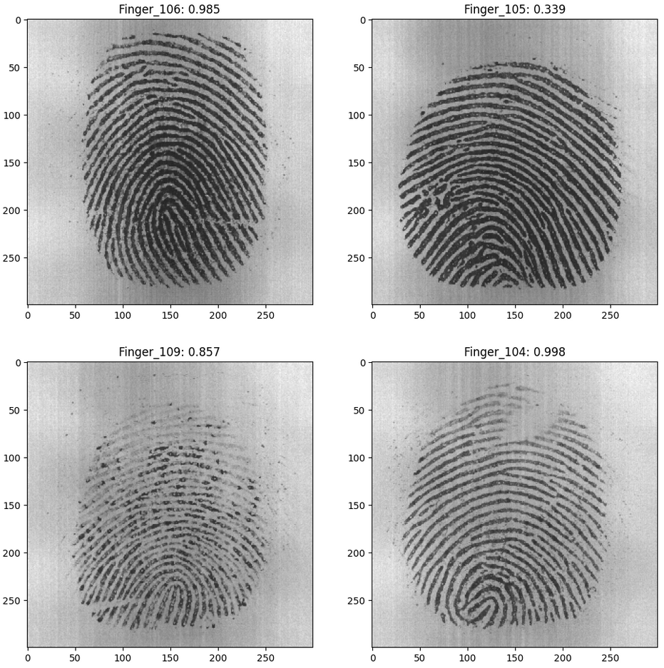
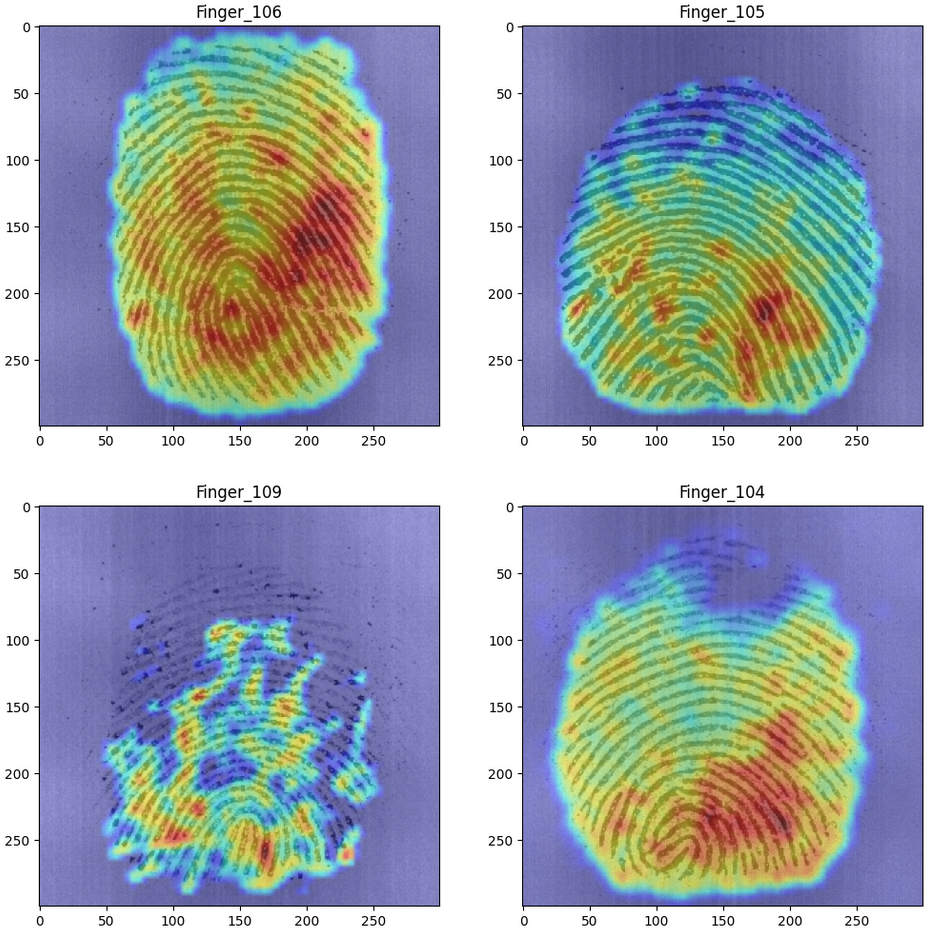

# 📘 CNN-Fingerprint-Matching

This repository contains a project for fingerprint matching using Convolutional Neural Networks (CNN). The project leverages a custom dataset and TensorFlow to train a model that can accurately identify fingerprint images.

## 🚀 Project Structure

The project is structured into one Jupyter Notebook script and folders with images of fingerprints. Main script handling various stages of the machine learning pipeline, including data loading, preprocessing, model training, and evaluation.

### 📂 Code

The main code includes scripts for:
- Reading and preprocessing fingerprint images.
- Splitting data into training and testing sets.
- Defining and training the CNN model.
- Evaluating the model's performance.

```python
# Example code snippet
model = keras.Sequential([
    layers.Conv2D(64, (3, 3), activation='relu', input_shape=(300, 300, 1)),
    layers.MaxPooling2D(3, 3),
    ...
])
```

## 📊 Data

The data folder contains the FVC2002 fingerprint dataset, used for training and testing the model. This includes images processed and labeled based on fingerprint characteristics.

## 🔍 Model Overview

The CNN model used in this project includes several convolutional layers, pooling layers, and dense layers, tailored to recognize patterns in fingerprint images effectively.

```python
model = keras.Sequential()

model.add(layers.Conv2D(64, (3, 3), strides=(1, 1), input_shape=(300, 300, 1)))
model.add(layers.Activation('relu'))
model.add(layers.MaxPooling2D(pool_size=(3, 3), strides=(2, 2)))

model.add(layers.Conv2D(128, (3, 3), strides=(1, 1)))
model.add(layers.Activation('relu'))
model.add(layers.MaxPooling2D(pool_size=(3, 3), strides=(2, 2)))

model.add(layers.Conv2D(256, (3, 3), strides=(1, 1)))
model.add(layers.Activation('relu'))
model.add(layers.MaxPooling2D(pool_size=(3, 3), strides=(2, 2)))

model.add(layers.Flatten())
model.add(layers.Dense(2048))
model.add(layers.Activation('relu'))

model.add(layers.Dense(num_classes))
model.add(layers.Activation('softmax'))

model.summary()

model.compile(optimizer=Adam(learning_rate=0.001), loss='categorical_crossentropy', metrics=['accuracy'])
```

## 🌐 Model Training

Training involves 30 epochs where the model learns to minimize loss and improve accuracy over time.

## 🖼️ Example Outputs

Here we display some of the fingerprint images from the dataset, along with their predicted classes. You can see the model's predictions and their associated confidence levels.

> **Images used from FVC2002 dataset**

### Classification output



### GRAD CAM output



## 📈 Performance

The performance of the model after training is quantified by its accuracy and loss metrics. In the final testing phase, the model achieved an accuracy of 56.25% with a loss of 3.0189. This was observed during a single evaluation step, detailed as follows:

```plaintext
1/1 [==============================] - 1s 1s/step - loss: 3.0189 - accuracy: 0.5625
```
